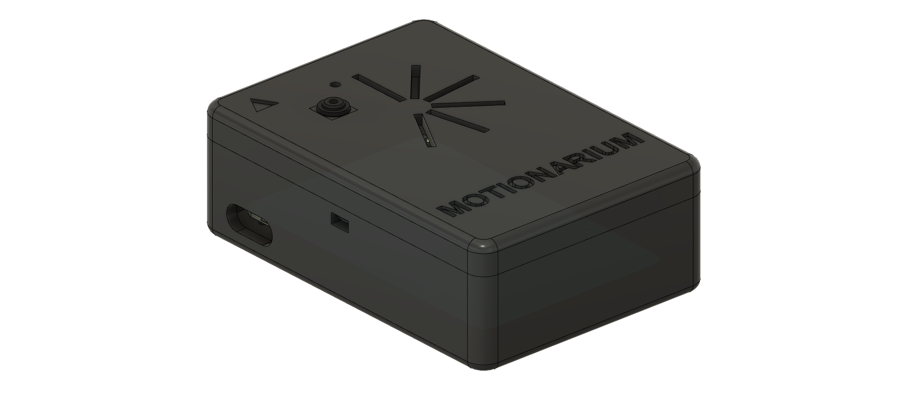

# موشناریوم | Motionarium

پروژه آز سخت‌‌افزار - بهار ۱۴۰۱

دانشکده مهندسی کامپیوتر - دانشگاه صنعتی شریف

## اعضا
علی حاتمی تاجیک، امیر‌محمد عیسی‌زاده

## درباره پروژه
پردازش تصویر و فهمیدن فرمان انسان با پردازش حرکات آن از جانب کامپیوتر در دهه های اخیر مورد توجه بسیاری قرار گرفته است. اینکار میتواند فواید گوناگونی داشته باشد. اول اینکه با هوشمند سازی فهم دستورات، میتوانیم در وقت صرفه جویی کنیم و تجربه راحت تر و لذت بخش تری را برای کاربر ایجاد کنیم. در واقع سختی کار با ماوس فیزیکی، مسئله ای اجتناب ناپذیر است. بنابراین با حذف این آپشن، ماوس های تصویری جایگزین میشوند. این کار به کمک پردازش تصویر گرفته شده از دست کاربر که مکان و جابجایی هاي آن به حرکت نشانگر موشواره و عملیات هاي مربوط به آن منجر می شود. در کنار این تعدادي حالات قابل تعیین براي کاربر براي روانتر شدن داشته رابط کاربري وجود داشته باشد.

## منابع مهم این مخزن
* [گزارش نهایی](./Document/Final/Report-Group-3-Final.pdf)
* [دیتاشیت](./Datasheet/Datasheet.pdf)
* [بدنه محصول](./Miscellaneous/)

## ویدئو محصول
شما می‌توانید ویدئو مربوط به محصول را از [آپارات](https://www.aparat.com/v/ymRzw)
یا از طریق [YouTube](https://youtu.be/0RrUzkMiMiY) تماشا کنید.
